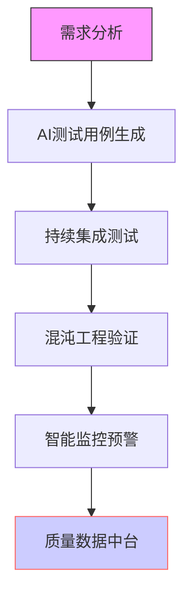

---
# 这是文章的标题
title: 页面配置
# 你可以自定义封面图片
cover: /assets/images/cover1.jpg
# 这是页面的图标
icon: file
# 这是侧边栏的顺序
order: 1
# 设置作者
author: 吴鑫程
# 设置写作时间
date: 2020-01-01
# 此页面会出现在星标文章中
star: true
# 设置跳转Github是否展示
editLink: false
# 设置贡献者是否展示
contributors: false
# 设置上次编辑于时间是否展示
lastUpdated: false
copy: false

# - 分类为 “使用指南”
# - 标签为 “页面配置” 和 “使用指南”
category:
  - 使用指南
# 一个页面可以有多个标签
tag:
  - 页面配置
  - 使用指南
# 此页面会在文章列表置顶
sticky: true

---
<!-- more -->
## 页面标题

<!-- 
  这是多行注释，
  可以跨多行书写，
  渲染后不可见。
-->

```md
# 软件测试：从质量保障到工程创新的范式跃迁

## 引言：测试驱动变革的数字时代
在数字化转型浪潮中，软件测试已从"代码校对"演变为数字世界的质量工程。正如前微软亚洲研究院博士陈宏刚所言："软件测试不是开发活动的收尾工作，而是贯穿开发周期的核心质量工程"[1](@ref)。这个观点在2025年得到充分印证——全球软件测试市场规模预计以**8-12%年增速**扩张，中国软件业务收入突破**12.3万亿元**，测试环节成为价值创造的战略要地[7](@ref)。

以IE4.0的经典案例为鉴，其代码开发耗时6个月，而稳定性测试长达8个月。在云原生与AI赋能的今天，这种质量保障范式正在被重构：Testin云测通过AI测试平台将效率提升50%，成本降低30%[7](@ref)；DeepSeek智能测试系统实现漏测率降低83%，测试效率飙升5倍[1](@ref)。测试工程师的角色已从"缺陷猎人"转变为"质量架构师"，在DevOps流水线中构建起**自动化测试覆盖率超70%**的质量防护网[3](@ref)。

## 技术演进图谱（技术架构示意）


## 页面内容
::: tip 图片引入
 - 你可以将图片和 Markdown 文件放置在一起使用相对路径进行引用。
 - 对于 `.vuepress/public` 文件夹的图片，请使用绝对链接 `/` 进行引用。

:::

---


<div style="float: right; text-align: right;">
  <sub>上次编辑于: <span style="color: rgba(60, 60, 67, 0.78);">2024/5/16 22:40:49</span></sub><br>
  <sub>贡献者: <span style="color: rgba(60, 60, 67, 0.78);">吴鑫程</span></sub>
</div>
